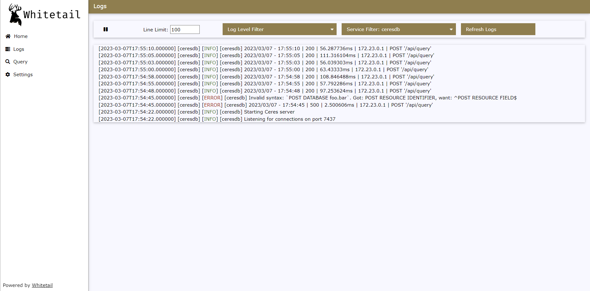

**************
Remote Logging
**************

.. toctree::
   :maxdepth: 2
   :caption: Contents:

CeresDB supports sending logs to the Whitetail log viewer. To send logs, set the following environment variables in your CeresDB deployment:

* ``CERESDB_WHITETAIL_LOGGING_ENABLED`` Set to ``true`` to enable Whitetail logging, defaults to ``false``
* ``CERESDB_WHITETAIL_LOGGING_HOST`` Host to connect to the Whitetail instance, defaults to ``whitetail``
* ``CERESDB_WHITETAIL_LOGGING_PORT`` Port to connect to the Whitetail instance, defaults to ``9002``
* ``CERESDB_WHITETAIL_LOGGING_APP_NAME`` Application name for the CeresDB instance, defaults to ``ceresdb``
* ``CERESDB_WHITETAIL_LOGGING_SELF_HOST`` Hostname for this CeresDB instance, defaults to ``ceresdb``

Example output within Whitetail is shown below:

